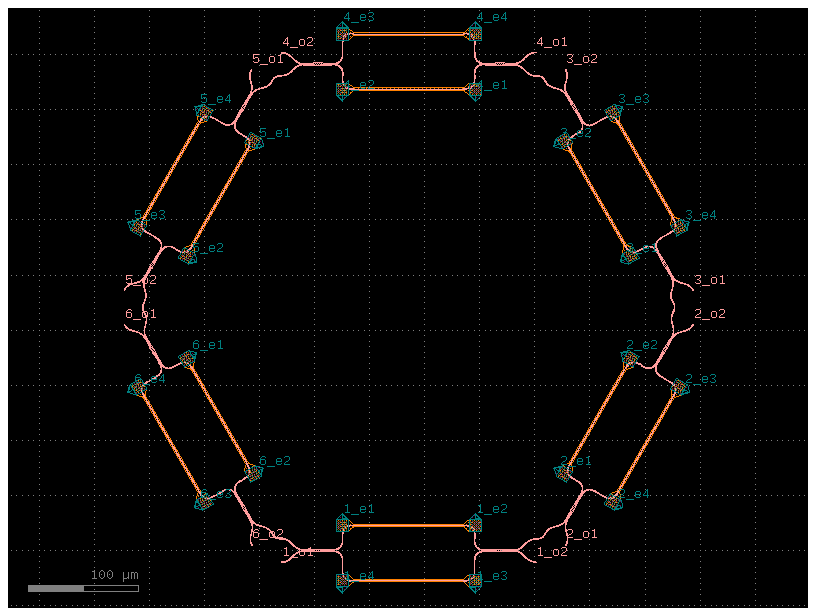
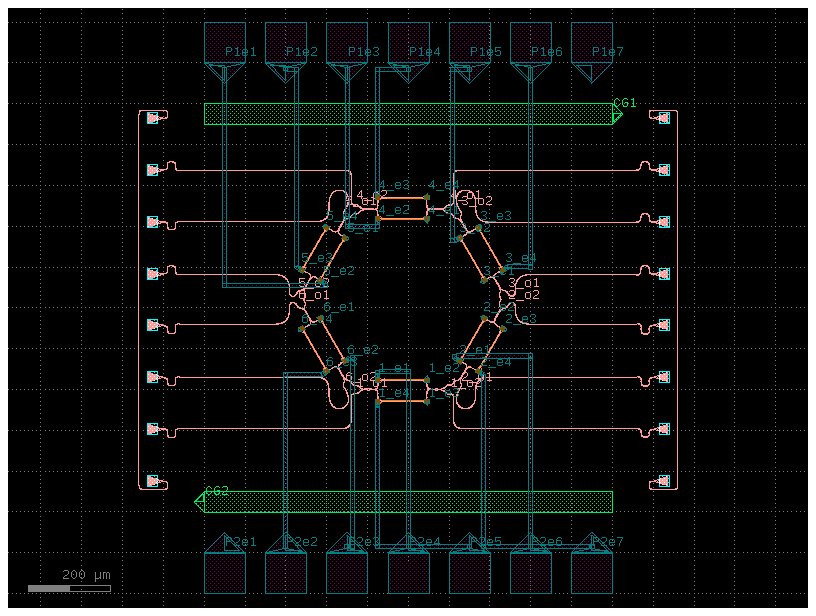
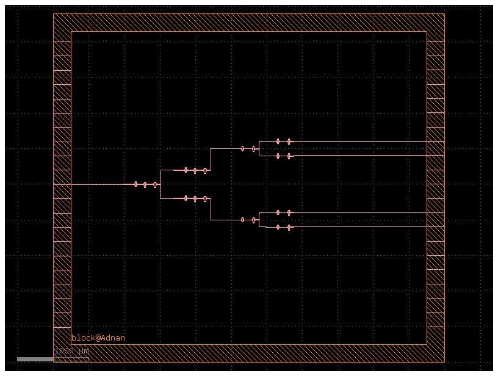
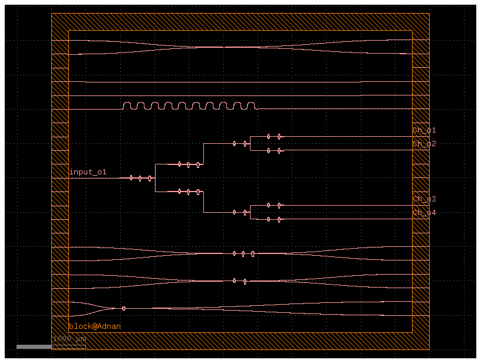

# PIC Layout
This folder contains various PIC layout designs developed during my training using **GDSFactory**. These layouts helped me understand the design flow of photonic integrated circuits, component placement, routing, and hierarchical cell design.

The work includes instructor-provided examples for learning, independent practice layouts, and layouts based on published research.

## 2. Hexagonal Mach–Zehnder Interferometer (MZI) with Thermal Heaters (Instructor Example)

  

This layout illustrates a hexagonal arrangement of cascaded **Mach–Zehnder Interferometers (MZIs)** integrated with **thermal heaters**. The design was provided by my instructor as a learning example and was implemented using the **Generic PDK** in GDSFactory.

Each MZI consists of optical splitters, waveguide arms, and combiners. The integrated heaters are positioned above the waveguides to enable **thermo-optic phase tuning**. By applying electrical power to the heaters, the refractive index of the waveguide changes due to the thermo-optic effect, allowing precise control of the optical phase difference between the interferometer arms. This phase tuning is essential for controlling the interference pattern and optimizing the device performance in many silicon photonic applications.

  

Working with this layout helped me understand:
- Mach–Zehnder Interferometer (MZI) operation.
- Thermo-optic phase tuning using integrated heaters.
- Optical and electrical routing within a PIC.
- Hierarchical layout design in GDSFactory.

## 2. CWDM (De)Multiplexer Layout
The main part of this work is a layout I created based on a research paper. 
I followed the design described in the paper and built the layout myself to 
practice and understand how it works.

  

The layouts include:

- Custom PIC layout designs created for practice.
- Layout of a Cascaded Mach–Zehnder Interferometer (MZI).
- Layout implementation of a CWDM (De)Multiplexer.
- Additional photonic components designed to improve my understanding of PIC development.

With some more components

  

## Paper Reference
**Title:** Fabrication-Tolerant CWDM (De)Multiplexer Based on Cascaded Mach-Zehnder 
Interferometers (MZI) on SOI  
**Author:** Tzu-Hsiang Yen

## What I did
- Studied the design described in the paper.
- Reproduced the layout of the cascaded MZI filter on a Silicon-on-Insulator (SOI) platform.
- Used this as part of my training to learn PIC layout design.

## Purpose
This repository is mainly to show my progress and the work I completed during 
my training, so others can see what I have learned and done so far.

