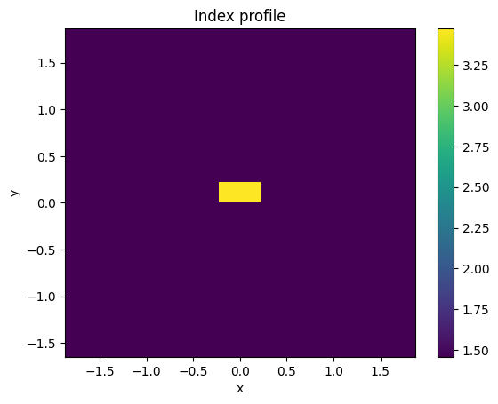
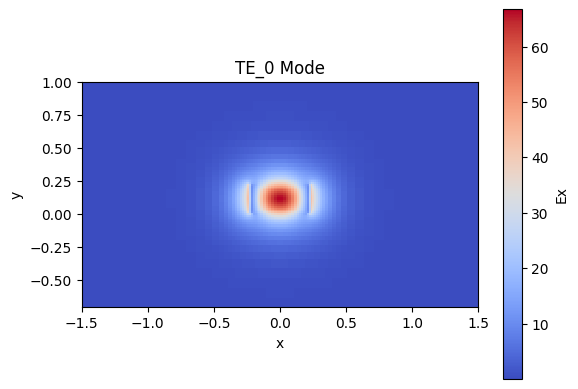
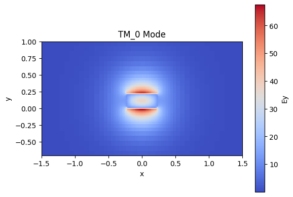
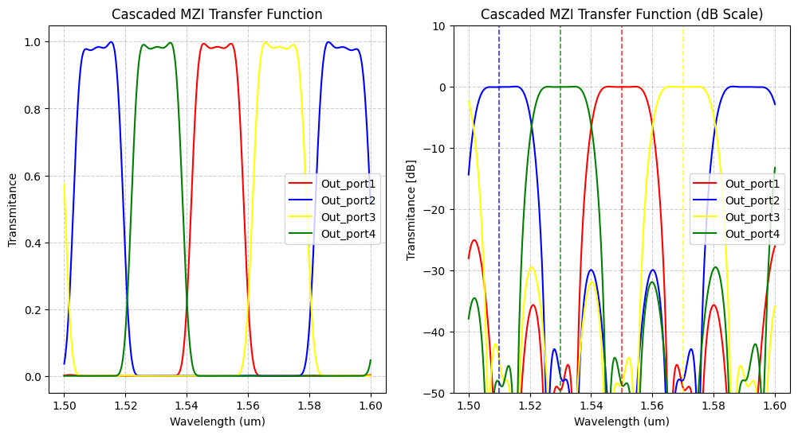

# Simulation 
Designing and simulating a CWDM (de)multiplexer based on cascaded Mach-Zehnder Interferometers (MZIs) on a silicon-on-insulator (SOI) platform.

The first step of the project was to study the propagation modes of a silicon-on-insulator (SOI) waveguide.
An SOI waveguide with a width of 450 nm and a thickness of 220 nm was defined

  

The waveguide was simulated using the Tidy3d  mode solver

  

  

From these simulations, the effective refractive index (neff) and the group index (ng) were extracted. The electric field distribution of each mode was also examined to understand how the optical field is confined inside the waveguide.

The simulations confirmed that the selected waveguide dimensions support the fundamental guided modes with good optical confinement. The calculated effective and group indices provide the basic design parameters required for later stages of the project, including interferometers and directional couplers.

  

