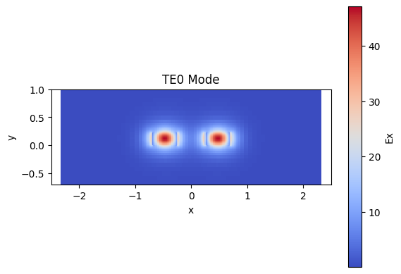

# Simulation 
Designing and simulating a CWDM (de)multiplexer based on cascaded Mach-Zehnder Interferometers (MZIs) on a silicon-on-insulator (SOI) platform.

# Waveguide
The first step of the project was to study the propagation modes of a silicon-on-insulator (SOI) waveguide.
An SOI waveguide with a width of 450 nm and a thickness of 220 nm was defined

<table  align="center">
  <tr>
    <td align="center" width="50%">
       
      <b>Fig. 1.</b> SOI Waveguide Structure.
    </td>
  </tr>
</table>

The waveguide was simulated using the Tidy3d  mode solver

<table>
  <tr>
    <td align="center" width="50%">
       
      <b>Fig. 2.</b> Fundamental TE Mode.
    </td>
    <td align="center" width="50%">
       
      <b>Fig. 3.</b> Fundamental TM Mode.
    </td>
  </tr>
</table>

From these simulations, the effective refractive index (neff) and the group index (ng) were extracted. The electric field distribution of each mode was also examined to understand how the optical field is confined inside the waveguide.

The simulations confirmed that the selected waveguide dimensions support the fundamental guided modes with good optical confinement. The calculated effective and group indices provide the basic design parameters required for later stages of the project, including interferometers and directional couplers.

  
  <b>Fig. 4.</b> .

# Design of Directional Couplers

Directional couplers are one of the most important passive components in photonic integrated circuits because they divide optical power between two waveguides. The objective of this part was to design directional couplers with different coupling ratios required for the cascaded Mach–Zehnder interferometer.

There are two common ways to design a directional coupler for a specific coupling coefficient: by varying the gap at a fixed length, or by varying the coupling length at a fixed gap. In this project, the gap was fixed first, and the beat length (L_π) was extracted from the mode simulation. The required coupler length for each target coupling ratio (κ) was then calculated from the ratio L_coupler / L_π, using the relation κ = sin²(π·L_coupler / 2L_π). This is what Fig. 9 shows κ plotted against L_coupler/L_π, with the five target coupling ratios marked on the curve.

A parameter sweep was performed by changing the gap between the waveguides and the coupling length. For each design, the optical power transferred between the two waveguides was simulated, and the corresponding coupling coefficient was calculated.

  
  <b>Fig. 5.</b> 

A parameter sweep was performed by changing the gap between the waveguides and the coupling length. For each design, the optical power transferred between the two waveguides was simulated, and the corresponding coupling coefficient was calculated.

<table>
  <tr>
    <td align="center" width="50%">
       
      <b>Fig. 6.</b> Directional Coupler Structure.
    </td>
    <td align="center" width="50%">
       
      <b>Fig. 7.</b> Fundamental TM Mode.
    </td>
  </tr>
</table>

Different combinations of coupling gap and interaction length were investigated until the required coupling ratios were achieved. The target coupling coefficients included values such as 0.50, 0.30, and 0.23, which are required for the final CWDM (De)Multiplexer design.

  
  <b>Fig. 8.</b> 

# Cascaded MZI Filter Using SAX Model

Using the simulated waveguide and coupler parameters, a circuit-level model of a single MZI stage was built using SAX, a scattering-matrix-based photonic circuit simulator. Two MZI variants (S1 and S2) were defined, matching the two building blocks used in the cascaded filter architecture. The arm-length difference (ΔL) between the two MZI arms was calculated from the effective index at the center wavelength (1.55 µm) to set the correct free spectral range (FSR).

  
  <b>Fig. 9.</b> .

Simulated transmission spectrum of the S1 MZI stage, showing the through and drop ports.

  
  <b>Fig. 10.</b> 

The individual S1 and S2 stages were connected into a four-stage cascaded network, forming the full 4-channel CWDM (de)multiplexer. The final circuit model was simulated across the 1.5–1.6 µm range to confirm that each of the four wavelength channels (1510 nm, 1530 nm, 1550 nm, 1570 nm) is correctly routed to its own output port.

<table align="center">
  <tr>
    <td align="center" width="70%">
       
      <b>Fig. 11.</b> Final Result of designed device.
    </td>
  </tr>
</table>

