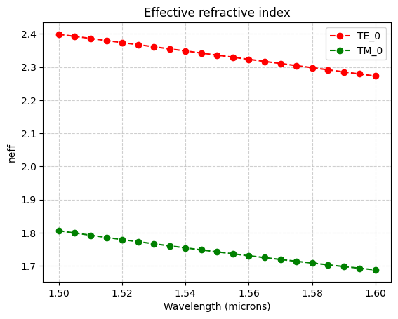
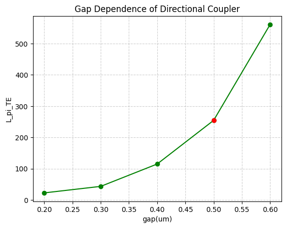
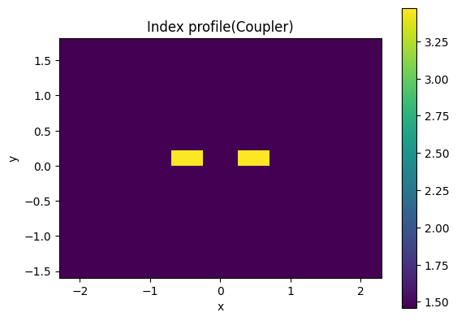
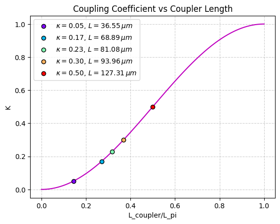
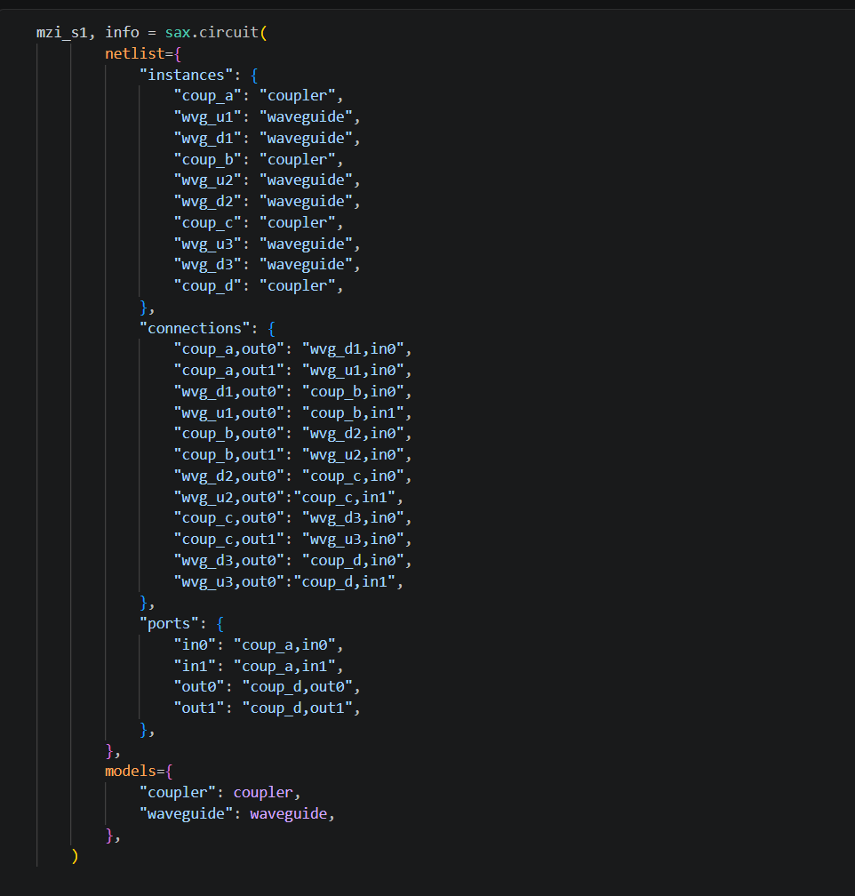
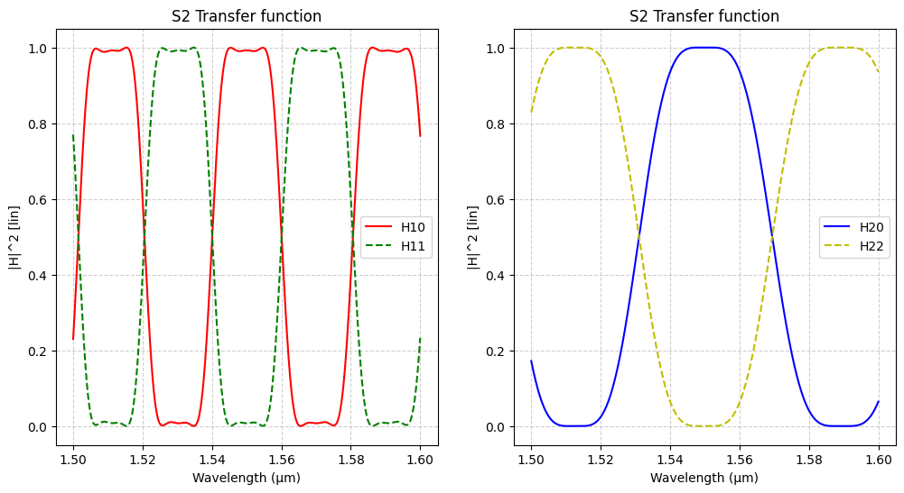

# Simulation 
Designing and simulating a CWDM (de)multiplexer based on cascaded Mach-Zehnder Interferometers (MZIs) on a silicon-on-insulator (SOI) platform.

# Waveguide
The first step of the project was to study the propagation modes of a silicon-on-insulator (SOI) waveguide.
An SOI waveguide with a width of 450 nm and a thickness of 220 nm was defined

  

The waveguide was simulated using the Tidy3d  mode solver

  

  

From these simulations, the effective refractive index (neff) and the group index (ng) were extracted. The electric field distribution of each mode was also examined to understand how the optical field is confined inside the waveguide.

The simulations confirmed that the selected waveguide dimensions support the fundamental guided modes with good optical confinement. The calculated effective and group indices provide the basic design parameters required for later stages of the project, including interferometers and directional couplers.

  

# Design of Directional Couplers

Directional couplers are one of the most important passive components in photonic integrated circuits because they divide optical power between two waveguides. The objective of this part was to design directional couplers with different coupling ratios required for the cascaded Mach–Zehnder interferometer.

A parameter sweep was performed by changing the gap between the waveguides and the coupling length. For each design, the optical power transferred between the two waveguides was simulated, and the corresponding coupling coefficient was calculated.

  

  

  

  

Different combinations of coupling gap and interaction length were investigated until the required coupling ratios were achieved. The target coupling coefficients included values such as 0.50, 0.30, and 0.23, which are required for the final CWDM (De)Multiplexer design.

# Cascaded MZI Filter Using SAX Model

  

  

  

